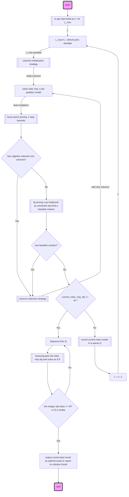

# parallel machine scheduling
***
##1.introduction
   - generalization of the single machine
   - special case of flow shop
   - decomposition procedures for multistage systems
<br>

##2. the makespan without preemption: **$P_m$||$C_{max}$**
   - ***LPT(longest process time first) rule*** : yield a good bound, not optimal *<u>(page95)</u>*
   - ***LFJ(least flexible job fist) rule***: optimal for **$P_m$| $p_j=1$,$M_j$ | $C_{max}$** *<u>(page103)</u>*
<br>    
##3. the makespan with preemption
   - ***An optimal algorithm: more practical in practise*** *<u>(page106)</u>*
   - ***LRPT largest remaining process time fist***: optimal rule for discrete time and continues time  **$P_m$|$r_j$, $prmp$ |$C_{max}$**(可以指定一个整数的时间间隔来切换，得到方案后再重新整理，使方案更合理)*<u>(page108)</u>*
   - ***LRPT-FM largest remaining process time fist to the fast machine***: optimal rule for discrete time and continues time **$Q_m$| $r_j$,$prmp$ |$C_{max}$** (可以指定一个整数的时间间隔来切换，得到方案后再重新整理，使方案更合理)*<u>(page111)</u>*
  <br>
##4. the total  completion time without preemptions
- ***SPT shortest process time first rule*** : optimal for both **$P_m$||$\sum$$C_j$ and 1||$\sum$$C_j$** *<u>(page112)</u>*
- ***WSPT weight shortest process time first rule*** : optimal for  **1||$\sum$$w_j$$C_j$**, but not optimal for **$P_m$||$\sum$$w_j$$C_j$** *<u>(page113)</u>*
<br>
##5. the total completion time with preemptions
   - ***SPT shortest process time first rule***： optimal for **$P_m$| $prmp$ |$\sum$$C_j$** *<u>(page116)</u>*
   - ***SRPT-FM shortest remian process time with fast machine first rule***： optimal for **$Q_m$| $prmp$ |$\sum$$C_j$** *<u>(page117)</u>*


## 6. *a column generation approach*  for $R_m$|$r_j$,$d_j$,$prec$|$L_{max}$ [1]

- solution procedure


- initial column strategy: 
  ``` mermaid
   flowchart TB
      subgraph initial
         direction LR
         job_type[select jobs with arc in set arcs, otherwise in set noarcs]
         job_type--->machine[add one machine to set machines]
      end
      subgraph addarcjob
         direction LR
         arc_dequeue[pick an arc]
         arc_dequeue-->arcjob_insert[ place job to the first machine of machine_set which can commodate the job ]
         arcjob_insert--->arcjob_cond1{add job success?}
         arcjob_cond1--->|Yes|arcjob_record[mark job's C]-->arcjob_cond2{all arc finished?}
         arcjob_cond1--->|No| add_machine[add a new machine to machine_set, place job to machine]--->arcjob_record
         arcjob_cond2--->|Yes|add_arc_job[add arc job finish]
         arcjob_cond2--->|No|arc_dequeue
      end
      subgraph addnoarcjob
         direction LR
         job_dequeue[pick an job]
         job_dequeue-->job_insert[ place job to the first machine of machine_set which can commodate the job ]
         job_insert--->job_cond1{add job success?}
         job_cond1--->|Yes|job_record[mark job's C]-->job_cond2{all arc finished?}
         job_cond1--->|No| add_job_machine[add a new machine to machine_set, place job to machine]--->job_record
         job_cond2--->|Yes|add_noarc_job[add no arc job finish]
         job_cond2--->|No|job_dequeue
      end

      begin(start)-->initial
      initial-->addarcjob
      addarcjob--->addnoarcjob
      addnoarcjob--->finish(end)
  ```

- local search
  ```mermaid
   flowchart TB
   begin(start)-->initial[random select jobs]
   initial-->rank_jobs[step1 method cal reduced cost for selct jobs]
   rank_jobs-->negative{is_nagetive?}
   negative--->|Yes| add[add jobs to columns]
   negative --->|No| step2[apply step2 methond] 
   add--->step2--->step1[step1 method cal reduced cost for new jobs]
   step1--->enough[until colums size == 50]
   enough--->finishe(end)

  ```
## reference:
[1] Using column generation to solve parallel machine scheduling problems with minmax objective functions
[2] Parallel machine scheduling by column generation
[3] A linear programming and constraint propagation-based lower bound for the RCPSP
